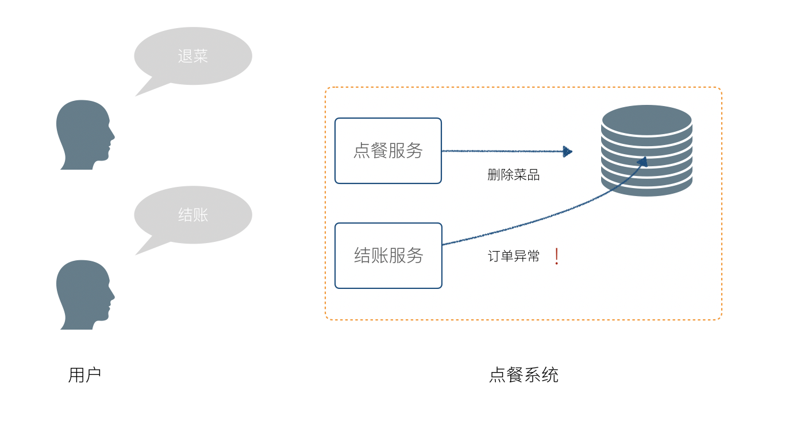
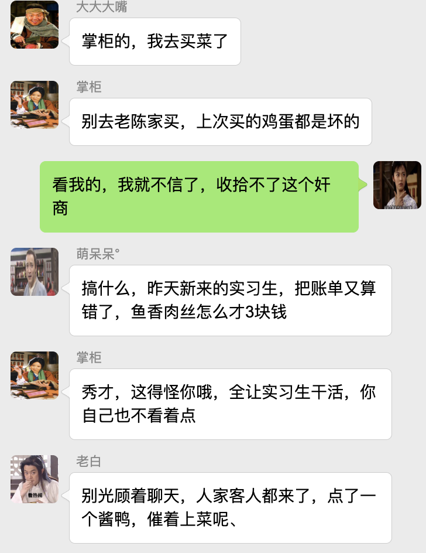
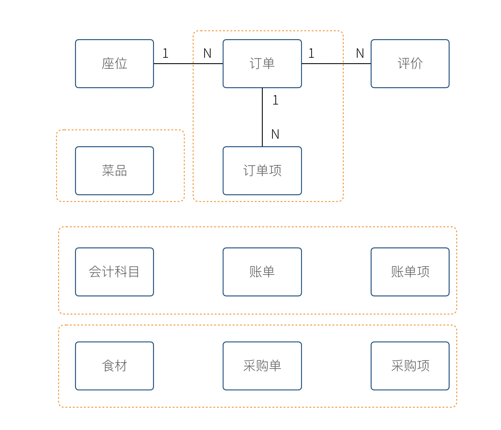
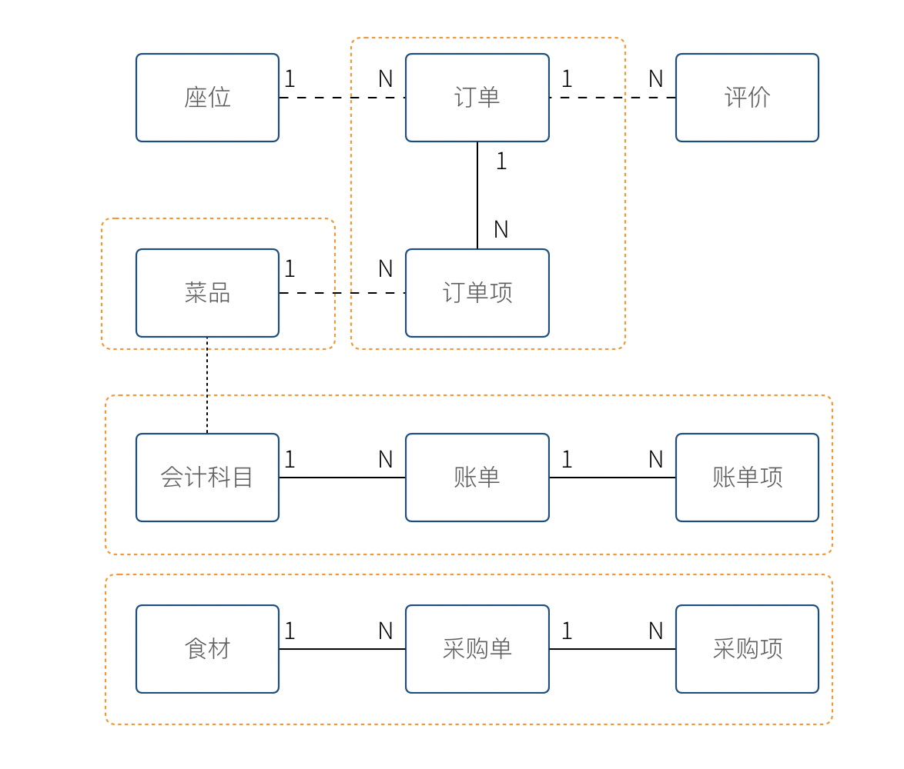

DDD 基础
===

领域驱动设计（DDD） 是 Eric Evans 提出的一种软件设计方法和思想，主要解决业务系统的设计和建模。DDD 有大量难以理解的概念，尤其是翻译的原因，某些词汇非常生涩，例如：模型、限界上下文、聚合、实体、值对象等。

实际上 DDD 的概念和逻辑本身并不复杂，很多概念和名词是为了解决一些特定的问题才引入的，并和面向对象思想兼容，可以说 DDD 也是面向对象思想中的一个子集。如果遵从奥卡姆剃刀的原则，“如无必要，勿增实体”，我们先把 DDD 这些概念丢开，从一个案例出发，在必要的时候将这些概念引入。

## 从纸和笔思考 IT 系统的工作逻辑

让我真正对计算机软件和建模有了更深入的认识是在一家餐厅吃饭的时候。数年以前，我还在一家创业公司负责餐饮软件的服务器端的开发工作，因为工作的原因，外出就餐时常都会对餐厅的点餐系统仔细观察，以便于改进我们自己产品的设计。

一次偶然的情况，我们就餐的餐厅停电了，所幸是在白天，对我们的就餐并没有什么影响。我突然很好奇这家店，在收银系统无法工作的情况下怎么让业务继续运转，因此我饶有趣味的等待服务员来接受我们的点单。

故事的发展并没有超出预期，服务员拿了纸和笔，顺利的完成了点餐，并将复写纸复写的底单麻溜的撕下来交给了后厨。我这时候才回过神来。

**软件工程师并没有创造新的东西，只不过是数字世界的砖瓦工，计算机系统中合乎逻辑的过程，停电后人肉使用纸和笔一样合乎逻辑。**

合乎现实世界的逻辑和和规则，使用鼠标和键盘代替纸和笔，就是软件设计的基本逻辑。如果我们只是关注于对数据库的增、删、改、查（CRUD），实际上没有对业务进行正确的识别，这是导致代码组织混乱的根本原因。

会计、餐饮、购物、人员管理、仓储，这些都是各个领域实实在在发生的事情，分析业务逻辑，从中找出固定的模式，抽象成计算机系统中对象并存储。这就是 DDD 和面向对象思想中软件开发的一般过程。

你可能会想，我们平时不就是这样做的吗?

现实是，我们往往马上关注到数据库的设计上，想当然的设计出一些数据库表，然后着手于界面、网络请求、如何操作数据库上，业务逻辑被封装到一个叫做 Service 对象上，这个对象不承载任何状态，业务逻辑通过修改数据库实现。

一般来说这种方法也没有大的问题，甚至工作的很好，Fowler 将这种方法称作为 **事务脚本（Transaction Script）**。还有其他的设计模式，将用户界面、业务逻辑、数据存储作为一个“模块”，可以实现用户拖拽就可以实现简单的编程，.net、VF曾经提供过这种设计模式，这种设计模式叫做 SMART UI。

这种模式有一些好处。

- 非常直观，开发人员学习完编程基础知识和数据库 CRUD 操作之后就可以开发
- 效率高，能短时间完成应用开发
- 模块之间非常独立

麻烦在于，当业务复杂后，这种模式会带来一些问题。

虽然最终都是对数据库的修改，但是中间存在大量的业务逻辑，并没有得到良好的封装。客人退菜，并不是将订单中的菜品移除这么简单。需要将订单的总额重新计算，以及需要通知后厨尝试撤回在坐的菜。

不长眼的新手程序员擅自修改数据片段，整体业务逻辑被破坏。这是因为并没有真正的一个 “订单” 的对象负责执行相关的业务逻辑，`Sevice` 上的一个方法直接就对数据库修改了，保持业务逻辑的完整，完全凭程序员对系统的了解。

我们在各个餐厅交流的时候，发现这并不是一个 IT 系统的问题。某些餐厅，所有的服务员都可以收银，即使用纸和笔，收营员划掉菜品没有更新小计，另外的服务员结账时会发生错误。于是餐厅，约定修改菜品必须更新订单总价。

我们吸收到这个业务逻辑到 IT 系统中来，并意识到系统中这里有一些隐藏的模型：

- 订单
- 菜品

我们决定，抽象出订单、菜品的对象，菜品不应该被直接修改，而是通过订单才能修改，无论任何情况，菜品的状态变化都通过订单来完成。

复杂系统的状态被清晰的定义出来了， `Service` 承担处理各个应用场景的差异，模型对象处理一致的业务逻辑。

在接触 Eric Evans 的 DDD 概念之前，我们没有找到这种开发模式的名字，暂时称作为 **朴素模型驱动开发**。

## 模型和领域模型

从上面的例子中，模型是能够表达系统业务逻辑和状态的对象。

模型是一个非常宽泛的概念，任何东西都可以是模型，我们尝试给模型下一个定义，并随后继续将领域模型的概念外延缩小。

**模型，用来反映事物某部分特征的物件，无论是实物还是虚拟的** 古人用八个卦象作为世界运行规律的模型；地图用线条和颜色作为地理信息的模型；IT 系统用 E-R 作为对象或者数据库表关系的模型；

我们知道要想做好一个可持续维护的 IT 系统，实际上需要对业务进行充分的抽象，找出这些隐藏的模型，并搬到系统中来。如果发生在餐厅的所有事物，都要能在系统中找到对应的对象，那么这个系统的业务逻辑就非常完备。

现实世界中的业务逻辑，在 IT 系统业务分析时，适合某个行业和领域相关的，所以又叫做领域。

**领域，指的特定行业或者场景下的业务逻辑**。

**DDD 中的模型是指反应 IT 系统的业务逻辑和状态的对象，是从具体业务（领域）中提取出来的，因此又叫做领域模型**。

通过对实际业务出发，而非马上关注数据库、程序设计。通过识别出固定的模式，并将这些业务逻辑的承载者抽象到一个模型上。这个模型负责处理业务逻辑，并表达当前的系统状态。**这个过程就是领域驱动设计。**

我从这里面学到了什么呢？

我们做的计算机系统实际上，是替代了现实世界中的一些操作。按照面向对象设计的话，我们的系统是一个电子餐厅。现实餐厅中的实体，应该对应到我们的系统中去，用于承载业务，例如收银员、顾客、厨师、餐桌、菜品，这些虚拟的实体表达了系统的状态，在某种程度上就能指代系统，这就是模型，如果找到了这些元素，就很容易设计出软件。

后来，如果我什么业务逻辑想不清楚，我就会把电断掉，假装自己是服务员，用纸和笔走一边业务流程。

分析业务，设计对象，编写代码。这就是领域驱动设计的基本过程。

在我们之前的例子中，收银员需要负责处理收银的操作，同时表达这个餐厅有收营员这样的一个状态。收营员收到钱并记录到账本中，账本负责处理记录钱的业务逻辑，同时表达系统中有多少钱的状态。

## 分析领域模型时，请把”电“断掉

我们进行业务系统开发时，大多数人都会认同一个观点：将业务和模型设计清楚之后，开发起来会容易很多。

但是实际开发过程中，我们既要分析业务，也要处理一些技术细节，例如：如何响应表单提交、如何存储到数据库、事务该怎么处理等。

使用领域驱动设计还有一个好处，我们可以通过隔离这些技术细节，先讲业务逻辑建模，然后再完成技术实现，因为业务模型已经建立，技术细节无非就是响应用户操作和持久化模型。

我们可以吧系统复杂的问题分为两类：

- 业务复杂度
- 技术复杂度

**技术复杂度，软件设计中和技术实现相关的问题，例如处理用户输入，持久化模型，，处理网络通信等。**

**业务复杂度，软件设计中和业务逻辑相关的问题，例如为订单添加商品，需要计算订单总价，应用折扣规则等。**

当我们分析业务并建模时，不要关注技术实现，会带来极大的干扰。我学到最实用的思维方法，就是在这个过程把”电“断掉，技术复杂度中的用户交互想象成人工交谈，持久化想象成用纸和笔记录。

DDD 还强调，业务建模应该充分的和业务专家在一起，不应该只是实现软件的工程师自嗨。业务专家是一个虚拟的角色，有可能是一线业务人员、项目经理、或者软件工程师。

由于和业务专家一起完成建模，因此尽量不要选用非常专业的绘图的工具和使用技术语言。可以看出 DDD 只是一种建模思想，并没有规定使用的具体工具。我这里使用 PPT 的线条和形状，用 E-R 的方式表达领域模型，如果大家都很熟悉 UML 也是可以的。甚至实际工作中，我们大量使用便利贴和白板完成建模工作。

这个建模过程可以是技术人员和业务专家一起讨论出来，也可以是使用 ”事件风暴“ 这类工作坊的方式完成。

这个过程非常重要，DDD 把这个过程称作 **协作设计**。

通过这个过程，我们得到了领域模型。

![领域模型v1]]](../images/02-DDD-foundamental/ddd-v1.png)

上图使我们通过业务分析得到的一个非常基本的领域模型，我们的点餐系统中，会有座位、订单、菜品、评价几个模型。一个座位可以由多个订单，每个订单可以有多个菜品和评价。

同时，菜品也会被不同的订单使用。

## 上下文、二义性、统一语言

我们用这个模型开发系统，使用领域模型驱动的方式开发，相对于事务脚本的方式，已经容易和清晰很多了，但还是有一些问题。

有一天，市场告诉我们，这个系统会有一个逻辑问题。就是系统中菜品被删除，订单也不能查看。在我们之前的认知里面，订单和菜品是一个多对多的关系，菜品都不存在了，这个订单还有什么用。

菜品，在这里存在了致命的二义性！！！这里的菜品实际上有两个含义：

- 在订单中，表达这个消费项的记录，也就是订单项。例如，5号桌消费的鱼香肉丝一份。
- 在菜品管理中，价格为30元的鱼香肉丝，包含菜单图片、文字描述，以及折扣信息。

菜品管理中的菜品下架后，不应该产生新的订单，同时也不应该对订单中的菜品造成任何影响。

这些问题是因为，技术专家和业务专家的语言没有统一， DDD 认识到了这个问题，统一语言是实现良好的领域模型的前提，因此应该 ”大声的建模“。我在参与这个过程目睹过大量有意义的争吵，正是这些争吵让领域模型变得原来越清晰。

这个过程叫做 **统一语言**。

和现实生活中一样，产生二义性的原因是因为我们的对话发生在不同的上下文中，我们在谈一个概念必须在确定的上下文中才有意义。在不同的场景下，即使使用的词汇相同，但是业务逻辑本质都是不同的。想象一下，发生在《武林外传》中同福客栈的几段对话。

这段对话中实际上有三个上下文，这里的 ”菜“ 这个词出现了三次，但是实际上业务含义完全不同。

- 大嘴说去买菜，这里的菜被抽象出来应该是食材采购品，如果掌柜对这个菜进行管理，应该具有采购者、名称、采购商家、采购价等。
- 秀才说实习生把账单中的菜算错了价格，秀才需要对账单进行管理，这里的菜应该指的账单科目，现实中一般是会计科目。
- 老白说的客人点了一个酱鸭，这里老白关注的是订单下面的订单项，订单项包含的属性有价格、数量、小计、折扣等信息。

实际上，还有一个隐藏的模型——上架中商品。掌柜需要添加菜品到菜单中，客人才能点，这个商品就是我们平时一般概念上的商品。

我们把语言再次统一，得到新的模型。

4个被红色虚线框起来的区域中，我们都可以使用 ”菜品“ 这个词汇（尽量不要这么做），但大家都明确 ”菜品“ 具有不同的含义。这个区域被叫做 **上下文**。当然上下文不只是由二义性决定的，还有可能是完全不相干的概念产生，例如订单和座位实际概念上并没有强烈的关联关系，我们在谈座位的时候完全在谈别的东西，所以座位也应该是单独的上下文。

识别上下文的边界是 DDD 中最难得一部分，同时上下文边界是由业务变化动态变化的，我们把识别出边界的上下文叫做**限界上下文（Bounded Context）**。限界上下文是一个非常有用的工具，限界上下文可以帮助我们识别出业务的边界，并做适当的拆分。

限界上下文的识别难以有一个明确的准则，上下文的边界非常模糊，需要有经验的工程师并充分讨论才能得到一个好的设计。同时需要注意，限界上下文的划分没有对错，只有是否合适。跨限界上下文之间模型的关联有本质的不同，我们用虚线标出，后面会聊到这种区别。

使用上下文之后，带来另外一个收获。模型之间本质上没有多对多关系，如果有，说明存在一个隐含的成员关系，这个关系没有被充分的分析出来，对后期的开发会造成非常大的困扰。

## 聚合根、实体、值对象

CER 图

聚合：不求同年同月同日生，但求同年同月同日死。

## 

## 使用领域模型指导程序设计

### 指导数据库设计

- 表结构设计
- ORM 的正确使用
- ACID和BASE

### 指导 API 设计

- 更自然的 Restful API
- 只需要两层 PATH

### 指导对象设计

- 组合、继承、

### 指导代码组织

- 隔离业务复杂度和技术复杂度
- 单体应用的代码组织
- 微服务的代码组织

### 指导权限设计

- 在设计权限时怎么定义一个功能点？DDD 可以解决这个问题，application 上每一个方法都是一个 UseCase 那么，每一个方法可以作为一个权限控制点，再集合 RBAC 即可设计出合理的权限。

## DDD 的局限性 

- DDD 可操作性不够
- DDD 不适用于技术复杂度的项目

## 参考资料

- 

DDD 通过业务驱动让系统耦合更少，如果耦合变多，以及变复杂了。说明DDD用的不对。

领域模型的目的是支撑业务场景，如果没有场景，或者想象中的场景，属于过度设计。

如果场景变化，修改的地方过多，说明抽象不够。

模型划分方法之一是模型的生命周期不同，寻找聚合根、实体、值对象。

- 并不是真正的面向对象。例如订单，往往是 OrderService 操作数据库对象 Order，这里的 Order 往往只是数据库呈现的 Plain Object，没有业务逻辑。OrderServer 只是执行数据库命令的方法集合。
- 没有对行为充分复用，即使通过 service 有一些方法是重用的，但带来的是关注点不分离。例如，在系统中用户被创建有两种操作，注册、管理员添加用户。那么如果复用代码就会造成有一些参数会和特定场景有关，但对于其他场景是多余的。

当然，领域驱动设计具体细节还有很多，下面介绍领域以及领域模型相关的内容。

领域模型中，不应该存在多对多关系。