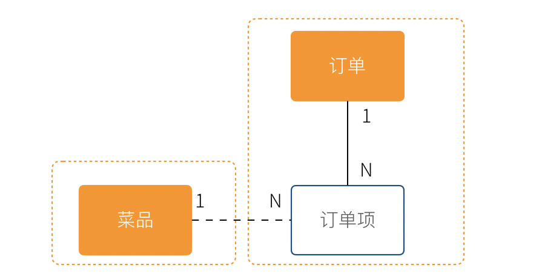
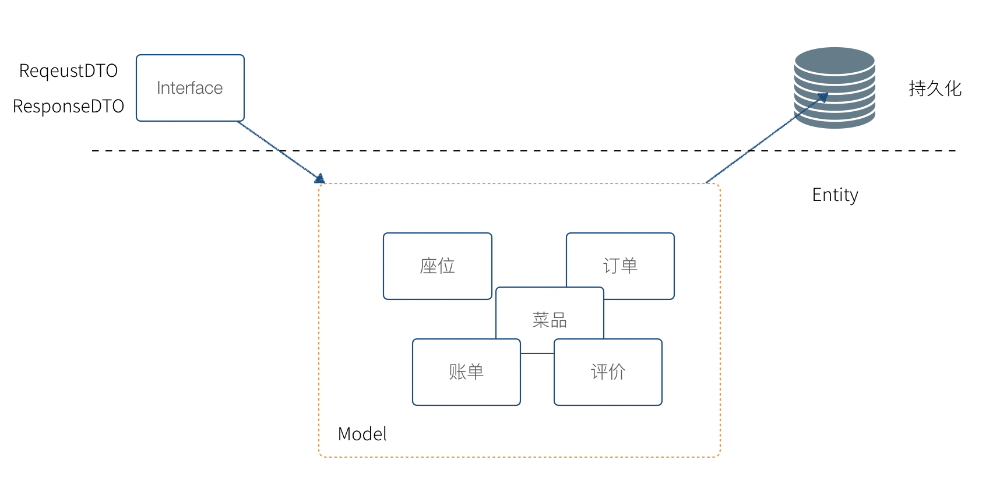
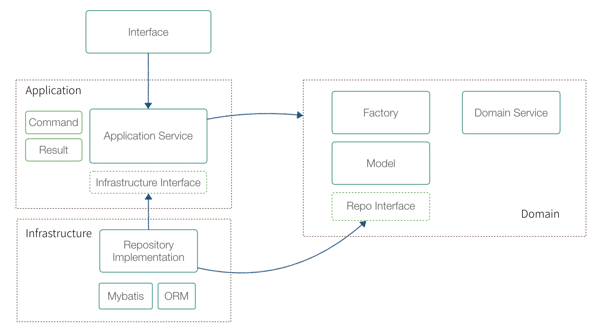

# DDD 基础

领域驱动设计（DDD） 是 Eric Evans 提出的一种软件设计方法和思想，主要解决业务系统的设计和建模。DDD 有大量难以理解的概念，尤其是翻译的原因，某些词汇非常生涩，例如：模型、限界上下文、聚合、实体、值对象等。

实际上 DDD 的概念和逻辑本身并不复杂，很多概念和名词是为了解决一些特定的问题才引入的，并和面向对象思想兼容，可以说 DDD 也是面向对象思想中的一个子集。如果遵从奥卡姆剃刀的原则，“如无必要，勿增实体”，我们先把 DDD 这些概念丢开，从一个案例出发，在必要的时候将这些概念引入。

## 从纸和笔思考 IT 系统的工作逻辑

让我真正对计算机软件和建模有了更深入的认识是在一家餐厅吃饭的时候。数年以前，我还在一家创业公司负责餐饮软件的服务器端的开发工作，因为工作的原因，外出就餐时常都会对餐厅的点餐系统仔细观察，以便于改进我们自己产品的设计。

一次偶然的情况，我们就餐的餐厅停电了，所幸是在白天，对我们的就餐并没有什么影响。我突然很好奇这家店，在收银系统无法工作的情况下怎么让业务继续运转，因此我饶有趣味的等待服务员来接受我们的点单。

故事的发展并没有超出预期，服务员拿了纸和笔，顺利的完成了点餐，并将复写纸复写的底单麻溜的撕下来交给了后厨。我这时候才回过神来。

**软件工程师并没有创造新的东西，只不过是数字世界的砖瓦工，计算机系统中合乎逻辑的过程，停电后人肉使用纸和笔一样合乎逻辑。**

合乎现实世界的逻辑和和规则，使用鼠标和键盘代替纸和笔，就是软件设计的基本逻辑。如果我们只是关注于对数据库的增、删、改、查（CRUD），实际上没有对业务进行正确的识别，这是导致代码组织混乱的根本原因。

会计、餐饮、购物、人员管理、仓储，这些都是各个领域实实在在发生的事情，分析业务逻辑，从中找出固定的模式，抽象成计算机系统中对象并存储。这就是 DDD 和面向对象思想中软件开发的一般过程。

你可能会想，我们平时不就是这样做的吗?

现实是，我们往往马上关注到数据库的设计上，想当然的设计出一些数据库表，然后着手于界面、网络请求、如何操作数据库上，业务逻辑被封装到一个叫做 Service 对象上，这个对象不承载任何状态，业务逻辑通过修改数据库实现。


一般来说这种方法也没有大的问题，甚至工作的很好，Fowler 将这种方法称作为 **事务脚本（Transaction Script）**。还有其他的设计模式，将用户界面、业务逻辑、数据存储作为一个“模块”，可以实现用户拖拽就可以实现简单的编程，.net、VF曾经提供过这种设计模式，这种设计模式叫做 SMART UI。

这种模式有一些好处。

* 非常直观，开发人员学习完编程基础知识和数据库 CRUD 操作之后就可以开发
* 效率高，能短时间完成应用开发
* 模块之间非常独立

麻烦在于，当业务复杂后，这种模式会带来一些问题。

虽然最终都是对数据库的修改，但是中间存在大量的业务逻辑，并没有得到良好的封装。客人退菜，并不是将订单中的菜品移除这么简单。需要将订单的总额重新计算，以及需要通知后厨尝试撤回正在制作中的菜。

不长眼的新手程序员擅自修改数据片段，整体业务逻辑被破坏。这是因为并没有真正的一个 “订单” 的对象负责执行相关的业务逻辑，`Sevice` 上的一个方法直接就对数据库修改了，保持业务逻辑的完整，完全凭程序员对系统的了解。


我们在各个餐厅交流的时候，发现这并不是一个 IT 系统的问题。某些管理不良餐厅，所有的服务员都可以收银，而不是专门的收营员收银；收营员划掉菜品没有更新小计，另外的服务员结账时会发生错误。按照程序设计的语言来说，这些餐厅人员职责不清晰，不符合面向对象的一些原则。

我们吸收到这些业务逻辑到 IT 系统中来，并意识到系统中这里有一些隐藏的模型：

* 订单
* 菜品

我们决定，抽象出订单、菜品的对象，菜品不应该被直接修改，而是通过订单才能修改，无论任何情况，菜品的状态变化都通过订单来完成。

复杂系统的状态被清晰的定义出来了， `Service` 承担处理各个应用场景的差异，模型对象处理一致的业务逻辑。

在接触 Eric Evans 的 DDD 概念之前，我们没有找到这种开发模式的名字，暂时称作为 **朴素模型驱动开发**。


## 模型和领域模型

从上面的例子中，模型是能够表达系统业务逻辑和状态的对象。

模型是一个非常宽泛的概念，任何东西都可以是模型，我们尝试给模型下一个定义，并随后继续将领域模型的概念外延缩小。

**模型，用来反映事物某部分特征的物件，无论是实物还是虚拟的** 古人用八个卦象作为世界运行规律的模型；地图用线条和颜色作为地理信息的模型；IT 系统用 E-R 作为对象或者数据库表关系的模型；

我们知道要想做好一个可持续维护的 IT 系统，实际上需要对业务进行充分的抽象，找出这些隐藏的模型，并搬到系统中来。如果发生在餐厅的所有事物，都要能在系统中找到对应的对象，那么这个系统的业务逻辑就非常完备。

现实世界中的业务逻辑，在 IT 系统业务分析时，适合某个行业和领域相关的，所以又叫做领域。

**领域，指的特定行业或者场景下的业务逻辑**。

**DDD 中的模型是指反应 IT 系统的业务逻辑和状态的对象，是从具体业务（领域）中提取出来的，因此又叫做领域模型**。

通过对实际业务出发，而非马上关注数据库、程序设计。通过识别出固定的模式，并将这些业务逻辑的承载者抽象到一个模型上。这个模型负责处理业务逻辑，并表达当前的系统状态。**这个过程就是领域驱动设计。**

我从这里面学到了什么呢？

我们做的计算机系统实际上，是替代了现实世界中的一些操作。按照面向对象设计的话，我们的系统是一个电子餐厅。现实餐厅中的实体，应该对应到我们的系统中去，用于承载业务，例如收银员、顾客、厨师、餐桌、菜品，这些虚拟的实体表达了系统的状态，在某种程度上就能指代系统，这就是模型，如果找到了这些元素，就很容易设计出软件。

后来，如果我什么业务逻辑想不清楚，我就会把电断掉，假装自己是服务员，用纸和笔走一边业务流程。

分析业务，设计领域模型，编写代码。这就是领域驱动设计的基本过程。随后会介绍，如何设计领域模型，当我们建立了领域模型后，我可以考虑使用领域模型指导开发工作。

* 指导数据库设计
* 指导模块分包和代码设计
* 指导 RESTful API 设计
* 指导事务策略
* 指导权限
* 指导微服务划分（有必要的情况）


在我们之前的例子中，收银员需要负责处理收银的操作，同时表达这个餐厅有收营员这样的一个状态。收营员收到钱并记录到账本中，账本负责处理记录钱的业务逻辑，同时表达系统中有多少钱的状态。

## 分析领域模型时，请把”电“断掉

我们进行业务系统开发时，大多数人都会认同一个观点：将业务和模型设计清楚之后，开发起来会容易很多。

但是实际开发过程中，我们既要分析业务，也要处理一些技术细节，例如：如何响应表单提交、如何存储到数据库、事务该怎么处理等。

使用领域驱动设计还有一个好处，我们可以通过隔离这些技术细节，先进行业务逻辑建模，然后再完成技术实现，因为业务模型已经建立，技术细节无非就是响应用户操作和持久化模型。

我们可以吧系统复杂的问题分为两类：

* 业务复杂度
* 技术复杂度


**技术复杂度，软件设计中和技术实现相关的问题，例如处理用户输入，持久化模型，处理网络通信等。**

**业务复杂度，软件设计中和业务逻辑相关的问题，例如为订单添加商品，需要计算订单总价，应用折扣规则等。**

当我们分析业务并建模时，过于关注技术实现，会带来极大的干扰。我学到最实用的思维方法，就是在这个过程把”电“断掉，技术复杂度中的用户交互想象成人工交谈，持久化想象成用纸和笔记录。

DDD 还强调，业务建模应该充分的和业务专家在一起，不应该只是实现软件的工程师自嗨。业务专家是一个虚拟的角色，有可能是一线业务人员、项目经理、或者软件工程师。

由于和业务专家一起完成建模，因此尽量不要选用非常专业的绘图的工具和使用技术语言。 DDD 只是一种建模思想，并没有规定使用的具体工具。我这里使用 PPT 的线条和形状，用 E-R 的方式表达领域模型，如果大家都很熟悉 UML 也是可以的。甚至实际工作中，我们大量使用便利贴和白板完成建模工作。

这个建模过程可以是技术人员和业务专家一起讨论出来，也可以是使用 ”事件风暴“ 这类工作坊的方式完成。

这个过程非常重要，DDD 把这个过程称作 **协作设计**。

通过这个过程，我们得到了领域模型。


上图使我们通过业务分析得到的一个非常基本的领域模型，我们的点餐系统中，会有座位、订单、菜品、评价几个模型。一个座位可以由多个订单，每个订单可以有多个菜品和评价。

同时，菜品也会被不同的订单使用。

## 上下文、二义性、统一语言

我们用这个模型开发系统，使用领域模型驱动的方式开发，相对于事务脚本的方式，已经容易和清晰很多了，但还是有一些问题。

有一天，市场告诉我们，这个系统会有一个逻辑问题。就是系统中菜品被删除，订单也不能查看。在我们之前的认知里面，订单和菜品是一个多对多的关系，菜品都不存在了，这个订单还有什么用。

菜品，在这里存在了致命的二义性！！！这里的菜品实际上有两个含义：

* 在订单中，表达这个消费项的记录，也就是订单项。例如，5号桌消费的鱼香肉丝一份。
* 在菜品管理中，价格为30元的鱼香肉丝，包含菜单图片、文字描述，以及折扣信息。

菜品管理中的菜品下架后，不应该产生新的订单，同时也不应该对订单中的菜品造成任何影响。

这些问题是因为，技术专家和业务专家的语言没有统一， DDD 认识到了这个问题，统一语言是实现良好的领域模型的前提，因此应该 ”大声的建模“。我在参与这个过程目睹过大量有意义的争吵，正是这些争吵让领域模型变得原来越清晰。

这个过程叫做 **统一语言**。


和现实生活中一样，产生二义性的原因是因为我们的对话发生在不同的上下文中，我们在谈一个概念必须在确定的上下文中才有意义。在不同的场景下，即使使用的词汇相同，但是业务逻辑本质都是不同的。想象一下，发生在《武林外传》中同福客栈的几段对话。


这段对话中实际上有三个上下文，这里的 ”菜“ 这个词出现了三次，但是实际上业务含义完全不同。

* 大嘴说去买菜，这里的菜被抽象出来应该是食材采购品，如果掌柜对这个菜进行管理，应该具有采购者、名称、采购商家、采购价等。
* 秀才说实习生把账单中的菜算错了价格，秀才需要对账单进行管理，这里的菜应该指的账单科目，现实中一般是会计科目。
* 老白说的客人点了一个酱鸭，这里老白关注的是订单下面的订单项，订单项包含的属性有价格、数量、小计、折扣等信息。

实际上，还有一个隐藏的模型——上架中商品。掌柜需要添加菜品到菜单中，客人才能点，这个商品就是我们平时一般概念上的商品。

我们把语言再次统一，得到新的模型。


4个被红色虚线框起来的区域中，我们都可以使用 ”菜品“ 这个词汇（尽量不要这么做），但大家都明确 ”菜品“ 具有不同的含义。这个区域被叫做 **上下文**。当然上下文不只是由二义性决定的，还有可能是完全不相干的概念产生，例如订单和座位实际概念上并没有强烈的关联关系，我们在谈座位的时候完全在谈别的东西，所以座位也应该是单独的上下文。

识别上下文的边界是 DDD 中最难得一部分，同时上下文边界是由业务变化动态变化的，我们把识别出边界的上下文叫做**限界上下文（Bounded Context）**。限界上下文是一个非常有用的工具，限界上下文可以帮助我们识别出业务的边界，并做适当的拆分。

限界上下文的识别难以有一个明确的准则，上下文的边界非常模糊，需要有经验的工程师并充分讨论才能得到一个好的设计。同时需要注意，限界上下文的划分没有对错，只有是否合适。跨限界上下文之间模型的关联有本质的不同，我们用虚线标出，后面会聊到这种区别。


使用上下文之后，带来另外一个收获。模型之间本质上没有多对多关系，如果有，说明存在一个隐含的成员关系，这个关系没有被充分的分析出来，对后期的开发会造成非常大的困扰。

## 聚合根、实体、值对象

上面的模型，尤其是解决二义性这个问题之后，已经能在实际开发中很好地使用了。不过还是会有一些问题没有解决，实际开发中，每种模型的身份可能不太一样，订单项必须依赖订单的存在而存在，如果能在领域模型图中体现出来就更好了。

举个例子来说，当我们删除订单时候，订单项应该一起删除，订单项的存在必须依赖于订单的存在。这样业务逻辑是一致的和完整的，游离的订单项对我们来说没有意义，除非有特殊的业务需求存在。

为了解决这个问题，对待模型就不再是一视同仁了。我们将那相关性极强的领域模型放到一起考虑，数据的一致性必须解决，同时生命周期也需要保持同步，我们把这个集合叫做**聚合**。

聚合中需要选择一个代表负责和全局通信，类似于一个部门的接口人，这样就能确保数据保持一致。我们把这个模型叫做**聚合根**。当一个聚合业务足够简单时，聚合有可能只有一个模型组成，这个模型就是聚合根，常见的就是配置、日志相关的。

相对于非聚合根的模型，我们叫做**实体**。


我们把这个图完善一下，聚合之间也是用虚线链接，为聚合根标上橙色。识别聚合根需要一些技巧。

* 聚合根本质上也是实体，同属于领域模型，用于承载业务逻辑和系统状态。
* 实体的生命周期依附于聚合根，聚合根删除实体应该也需要被删除，保持系统一致性，避免游离的脏数据。
* 聚合根负责和其他聚合通信，因此聚合根往往具有一个全局唯一标识。例如，订单有订单 ID 和订单号，订单号为全局业务标识，订单 ID 为聚合内关联使用。聚合外使用订单号进行关联应用。

还有一类特殊的模型，这类模型只负责承载多个值的用处。在我们饭店的例子中，如果需要对账单支持多国货币，我们将纯数字的 `price` 字段修为 `Price` 类型。

```java
public clsss Price(){
    private String unit;
    private BigDecimal value;    

    public Price(String unit,BigDecimal value){
        this.unit = unit;
        this.value = value;
    }
}
```

价格这个模型，没有自己的生命周期，一旦被创建出来就无须修改，因为修改就改变了这个值本身。所以我们会给这类的对象一个构造方法，然后去除掉所有的 `setter` 方法。

我们把没有自己生命周期的模型，仅用来呈现多个字段的值的模型和对象，称作为**值对象**。

值对象一开始不是特别好理解，但是理解之后会让系统设计非常清晰。”地址“是一个显著的值对象。当订单发货后，地址中的某一个属性不应该被单独修改，因为被修改之后这个”地址“就不再是刚刚那个”地址“，判断地址是否相同我们会使用它的具体值：省、市、地、街道等。

值对象是相对于实体而言的，对比如下。

| 实体 | 值对象 |
| :--- | :--- |
| ID 有意义 | ID 无意义（可能用于存储或引用） |
| 有自己的生命周期 | 一经创建就不要修改 |
| 可以对实体进行管理 | 使用新的值对象替换 |
| 使用 ID 进行相等性比较 | 使用属性进行相等性比较 |

另外值得一提的是，一个模型被作为值对象还是实体看待不是一成不变的，某些情况下需要作为实体设计，但是在另外的条件下却最好作为值对象设计。

地址，在一个大型系统充满了二义性。

* 作为订单中的收货地址时，无需进行管理，只需要表达街道、门牌号等信息，应该作为值对象设计。为了避免歧义，可以重新命名为收货地址。
* 作为系统地理位置信息管理的情况中具有自己的生命周期，应该作为实体设计，并重命名为系统地址。
* 作为用户添加的自定义地址，用户可以根据 ID 进行管理，应该作为实体，并重命名为用户地址。

我们使用蓝色区别实体和聚合根，更新后的模型图如下：


虽然我们使用 E-R 的方式描述模型和模型之间的关系，但是这个 E-R 图使用了颜色、虚线，已经和传统的 E-R 图大不相同，把这种图暂时叫做 **CE-R** 图（Classified Entity Relationship）。DDD 没有规定如何画图，你可以使用其他任何画图的方法表达领域模型。

## 使用领域模型指导程序设计

在了解到 DDD 之前，到底该用一对多和多对多关系？RESTful API 设计时到底应该选哪一个对象作为资源地址，评价应该放到订单路径下还是单独出来？订单删除相关有多少对象应该纳入事务管理？

在没有领域模型之前，这些大概率凭借经验决定，当我们把领域模型设计出来之后，领域模型可以帮助我们做出这些指导。领域模型不只是为编写业务逻辑代码使用，这样对领域模型来说就太可惜了。

下面是领域模型指导软件开发的一些方面，具体细节后面会再逐个讨论。

### 指导数据库设计

通过 CE-R 图，我们明显可以设计出数据库了。不过还有一些细节需要注意。

首先，在之前的认知里面，多对多关系是非常正常的。但是通过对领域模型的分析后发现，传统处理多对多关系时，需要额外增加一张关联表，这张关联表本质上是一个”关系“的实体没有被发掘出来。否则，在实际开发中会造成系统耦合，以及使用 ORM 的时候产生困惑。

菜品和订单之间是多对多关系吗？

如果是，菜品和订单之间耦合了。实际上，菜品的管理处于系统操作的上游，菜品不依赖订单的任何操作，也就是说订单的任何变化菜品无需关心。

订单拥有多个订单项，每个订单项从菜品读入数据并拷贝，或者引用一个菜品的全局 ID （菜品在另外一个聚合）。这样在设计表结构时订单和订单项关联，订单项不关联菜品。订单项应该从程序读取菜品信息。看起来多对多的关系，被细致分析后，变成了一个一对多关系。



在使用 ORM 时，良好的领域模型尤其有用。不合适的关联关系不仅让 ORM 关联变得混乱，还会让 ORM 的性能变差。

使用领域模型建立数据库的要点：

* 留意多对多关系，并拆解成一对多关系
* 值对象和实体往往为一对一关系
* 使用 ORM 时，聚合根和实体可以配置为级联删除和更新
* 禁止聚合根之间进行关联

### 指导 API 设计

RESTful API 已经变成了主流 API 设计方式，当设计好领域对象后，设计 API 的难度大大降低。

使用聚合根作为 URI 的根路径，使用实体作为子路径。通过 ID 作为 Path 参数。


值对象没有 ID，应该只能依附于某个实体的路径下做更新操作。


另外根据这个关系，处理批量操作的时候应该在实体的上一级完成，例如批量添加订单的订单项，可以设计为：

```text
POST /orders/{orderId}/items-batch
```

不要设计为:

```text
POST /orders/{orderId}/items/batch
```

### 指导对象设计

在实践中过程中，像 Java、Typescript具有类型系统的语言，对象很容易被误用。如果 `User` 对象既被拿来当做数据库操作使用，又被拿来当做接口呈现使用，这个类最终变成了上帝类，存在大量可有可无的属性。

例如用户注册时候需要输入重复密码，如果在 `User` 对象中添加 `confirmPassword` 属性，存储时候确并不需要。

因此 DDD 中，数据库各种对象的使用应该针对不同的场景设计。回到我们上面说的技术复杂度和业务复杂度中来。领域模型解决业务复杂度的问题，领域模型只应该被用作处理业务逻辑，存储、业务表现都应该和领域模型无关。



简单来说，可以把这些 `Plain Object` 分为三类:

* DTO，和交互相关或者和后端、第三方服务对接
* Entity，数据库表映射
* Model，领域模型

另外，在使用领域模型使用上也需要额外注意

* 领域对象尽量使用组合的方式，而不是继承，现实业务逻辑中继承这种概念实际上很少。例如菜品的设计，有热菜、汤菜、凉菜，实际上这里面并不是菜的继承，而应该抽象出分类这个模型。
* 不要滥用领域模型，有些业务逻辑，实在找不出一个领域模型很正常，所以 DDD 中存在一个领域服务。例如，生成一个 UUID。有些业务逻辑不持有系统业务状态，Eric 的书中比喻为像加油站一样的业务逻辑。

### 指导代码组织

代码组织，通俗来说就是如何分包。一种狭义的对 DDD 的理解就是指按照 DDD 风格进行代码组织，虽然 DDD 的内容远不止于此。

在很长一段时间，我对 DDD 分包策略陷入困惑，后来我明白到，讨论 DDD 风格的分包，必须将单体引用和微服务应用分开考虑。

> 微服务应用在逻辑上和解耦良好的单体应用是一致的。

但是微服务是一种分布式架构，映射到单体应用中，各个包分布到不同的服务器中了。我们先以单体应用入手，最后再讨论如何将单体应用架构映射到到微服务中。

在事务脚本的模式中，我们一般将代码分为三层架构。DDD 特别的抽离出一层叫做 `application`。这一层是 DDD 的精华，领域模型关心业务逻辑，但是不关心业务场景。

`application` 用来隔离业务场景，显得非常重要。举个例子，用户被添加到系统中，领域模型处理的是：

1. 用户被添加
2. 授予基本权限
3. 积分规则创建
4. 账户创建（三户模型，客户、用户、账户往往分开）
5. 客户资料录入

但是，用户被添加到系统中由多个应用场景触发。

* 用户被邀请注册
* 用户自己注册
* 管理员添加用户

`application` 需要隔离应用场景，并组织调配领域服务，才能使得领域服务真正被复用。因此 `application` 需要承担事务管理、权限控制、数据校验和转换等操作。当领域服务被调用时，应该是纯粹业务逻辑，并与场景无关。

如果我们将三层架构和 DDD 架构对比，DDD 架构如右图所示。


我们将 DDD 的代码架构展开，可以看到更为细节的内容。 DDD 代码实现上需要 `Repository`、`Factory` 等概念，但这些是可选的，我们在后面具体讲代码结构的部分再阐述。



我们再来看，DDD 的单体应用架构映射到微服务架构下会是怎么样的。


微服务必须考虑到不再是一个服务，`Domain` 层被抽离出来作为 `Domain Server` 存在，`Domain Server` 不关心业务场景，因此不需要 `application` 层。`Application Server` 需要 `Application` 层，`Domain` 层由后端的 `Domain Server` 提供。

另外补充，一些 DDD 代码组织的基本逻辑：

* 隔离业务复杂度和技术复杂度
* 使用接口隔离有必要的耦合和依赖倒置


## 在分布式系统中使用 DDD

在使用 DDD 的思想时，最让人迷惑的就是如何组织代码，也就是通常所说的系统架构的问题。在前面提到 DDD 可以很好地指导代码组织，其中举了两个例子，单体和微服务架构下 DDD 如何指导代码的组织方式。令人沮丧的是，大部分应用系统既不是完全的单体系统，也不是纯粹的微服务架构，而是出于某种中间状态。


无论我们使用单体、SOA、微服务、中台或者其他架构，都需要解决如何组织代码这个问题，DDD 并不是一个技术，而是指导我们组织代码的一种思想，这种思想也并不是凭空出现的。


就代码组织这个问题，看起来没有什么技术含量，但实际上非常重要，软件工程发展过程中出现过三次危机，软件危机泛指在计算机软件的开发和维护过程中所遇到的一系列严重问题，代码的组织和大规模协作是其重要的组成部分。


1. **结构化程序设计解决了第一次软件危机。**60年代~70年代计算机刚刚投入商业使用，主要的编程方式还是汇编语言在特定的机器上编写程序。当软件规模较小，基本上处于计算机科学家个人编码设计、使用的方式。随着软件规模扩大，复杂度增加，依赖特定机器、无结构化的编程方式无法应对软件的发展，带来了第一次软件危机。为了克服这个问题，业界提出了”软件工程“的概念，1972 年 C 语言的出现，解决了代码结构化、抽象性、可移植的问题。

2. **面向对象解决了第二次软件危机**。随着软件在商业中大规模使用，软件变得原来越复杂，即使结构化的 C 语言也无法满足业界对可维护性、可拓展性的需求。标志性的事件是 IBM 公司开发的 OS/360 系统失败，该系统有 4000 多个模块，约 100 万条指令，以及大量的 bug。面向对象的编程语言，Java、C#、C++ 出现，面向对象带来了更自然地代码组织方式，软件开发变得越像建筑业。
3. **第三次软件危机**。第三次软件危机还没有一个明确定义，通常来说就是互联网行业兴起，软件变得越来越复杂，需求越来越多变。软件开发从建筑业变成了服务业，需要随时响应变化，在软件行业表现为瀑布开发越来越不可行，敏捷开发越来越重要。从技术上表现为单机开发越来越不可行，分布式系统是必然的趋势。


每一次危机的解决，都是建立在前一次的基础之上的。面向对象是建立在结构化程序设计之上的，敏捷也是建立在瀑布之上的，而不是推翻前者。DDD 还停留在面向对象这个阶段，可以用来指导分布式系统设计，应对越来越复杂的应用系统，DDD 也不是面向对象思想的替代者。


DDD 的代码组织形式众说纷纭，并没有一个标准的代码架构。为什么会这样呢？实践中我们发现，不同公司、项目的业务背景不一致，架构不一致，架构的演化层次不一样（查看另外一篇文章《架构的演进》），标准的代码架构并不适合每一个公司。


当我们的系统架构从单体往 SOA、微服务、中台演变，无论名称如何变化，实际上都是分布式系统，只不过分布式的程度不一致而已。所以我们需要将问题拓展到分布式系统这个更大的概念上，再来谈 DDD 的代码组织形式才有意义。


我们看一下分布式系统下一个定义：

> 分布式系统是一组电脑，透过网络相互连接传递消息与通信后并协调它们的行为而形成的系统。——维基百科

从广义的分布式系统定义上来看，现在的互联网应用基本上没有不是分布式的了。分布式系统不是软件工程师主动选择的结构，而是业务逼得这样选择。阿里巴巴带动的去 IOE （去掉IBM的小型机、Oracle数据库、EMC存储设备，代之以自己在开源软件基础上开发的系统）就是一个很好的体现。


在这样的一个思维方式下，单体系统是只有一个计算节点的分布式系统，那么 DDD 在单体应用下的经验也可以应用起来。我没有找到一个专业术语描述分布式系统程度，这里请允许我创造一个新词，**分布式级别。** 

### 分布式级别

为了解决业务上的问题，用户量大、业务规模大，当用户量增长到无法被容忍时，我们引入分库分表（分布式数据库）、垂直拆分业务（微服务）。


我们会将系统变得越来越复杂，然后不得不解决各种分布式系统下的新问题，业务上面临的问题被转移到技术上，从而业务才有可能持续性的发展。我们面临的问题不会消失，只会从一个地方转移到另外一个地方，转移到我们能容忍的地方，比如转移到云上，然后通过购买服务解决。


系统中节点角色越少，需要解决的分布式问题则越少，可以认为这是**低级别的分布式系统**。低级别的分布式系统 架构基本上没有什么分布式问题存在，目前主流的小项目通过 Nginx 让应用水平拓展 + 主从数据库的架构可以看做低级别的分布式系统。


系统中节点的角色越多，应用垂直拆分，需要解决的分布式问题就越多，遇到的技术挑战也越多，我们可以认为这是**高级别的的系统**。应用系统的例子就是微服务架构，另外一个例子就是大数据平台。


我把分布式级别做了如下划分，基本上可以囊括目前互联网应用系统的主流架构：


- 准单体系统
- 低级别分布式系统
- 高级别分布式系统
- 复杂分布式系统


| 分布式级别       | 案例 | 架构参考 | 业务价值 | 分布式系统问题 |
| ---------------- | ---------------- | ---------------- | ---------------- | ---------------- |
| 准单体系统      | 博客系统<br/>内网 OA 软件 | LAMP<br>Java单体 | 简单、成本低 | 无分布式问题 |
| 低级别分布式系统 | 小型互联网产品 | Nginx 负载均衡<br/>Redis 分布式会话<br/>读写分离<br />RDS | 应用水平拓展<br/>存储水平拓展 | 高可用问题<br/>动态负载均衡问题<br/>监控问题 |
| 高级别分布式系统 | 中型互联网产品 | SOA<br/>微服务<br/> | 应用垂直拓展<br/>存储垂直拓展 | 上一级别所有问题<br/>分布式事务<br/>关联查询<br/>服务发现<br/>熔断降级<br/>调用链跟踪 |
| 复杂分布式系统   | 大型互联网产品<br/>大数据平台 | 中台 | 各个服务独立演进<br/>业务复用 | 上一级别所有问题<br/>版本化问题<br/>团队协作问题<br/>性能开销 |


在微服务项目中经历过痛苦的开发者应该所有体会，全世界开发者贡献了大量的开源软件尝试解决这些问题，后面详细介绍每一个问题如何具体解决。


### 清醒的使用 DDD

上面这些分布式系统的问题，DDD 都解决不了。DDD 的作用只有一个：**在单体中划分模块，在分布式系统中划分服务。** 服务划分的良好，关联查询、授权、分布式一致性等问题可以被很好的解决，也就是我们常常说的**解耦**。


但是就这一个作用，对于做应用开发的业务系统来说至关重要，虽然对于专门解决技术复杂度问题的云厂商来说用处不大，所以最好让 DDD 在合适的地方发挥作用。高级别的微服务系统的修改成本如此之高，以至于服务划分错误几乎没有能力调整回来，甚至导致很多互联网公司就此走向失败。


因此，如何划分服务，这是 DDD 非常有价值的一个地方，在分布式系统中，DDD 起到的作用实际上就是指导垂直拓展。值得庆幸的是，应用系统分布式级别增加带来很多技术挑战，但是逻辑上的架构变化却不大。


在每一个不同的演化层次下，谈 DDD 的代码架构才有意义。例如单体系统没有必要过多分层，避免样板代码大量出现；微服务系统则需要小心分层，并严格执行，否则修改成本非常高。另外也需要解决该层次下的技术问题，微服务需要解决分布式事务问题、分布式授权问题、分布式缓存问题、性能问题等。


#### DDD 分层和职责

在 DDD 指导代码设计部分，我们提到了三层架构和 DDD 的四层架构的区别，DDD 的四层架构被越来越多的认可，但是每层具体的职责很少有文章谈到。根据实践经验，我把四层模型中具体的职责整理出来，用于团队在做架构设计中能有共同的认识。


前面的 DDD 四层模型的图为了表达每层中的元素，丢失了一个重要的角度，每一层的组件可能有多个。还是以收银机系统为例，架构会是像下面这样，业界大多数互联网架构图也是这样画的，只是使用术语略有不同。


实践中我们发现，接入层是由应用场景解决的，因此接入层需要在特定应用场景下使用。收银机应用下，接入层是 Restful  API 以及 socket 连接实现的实时通信，商户管理和平台管理无需使用这些接入方法，在不前后端分离的情况下，模板引擎也足够使用。

同样的，基础设施层是和领域层绑定到一起用于实现业务逻辑和规则，底层基础设施的选择由领域层决定。商品服务主要是和数据库打交道，需要使用 Mybatis，但是用户认证服务（图上未体现）可能只需要 Redis 做分布式会话即可。

接入层和技术设施层，更应该看做两个亚层。结合 DDD 术语将示例图调整如下：


#### 应用层

餐饮系统是一个非常复杂，具有多端、多租户的系统，往往有收银机应用、手机点餐应用、商户管理、平台管理等应用，从而组合成一个系统。在有些公司的语境里，应用层往往是根据用户角色划分的，被称为”业务面“。


应用层的特点：

- 关心处理完一个完整的业务

- 该层只负责业务编排，对象转换，实际业务逻辑由领域层完成

- 不关心请求从何处来，但是关心谁来、做什么、有没有权限做

- 集成不同的领域服务解决问题

- 最终一致性（最终一致性对业务有侵入）事务放到这层

- 对应到分布式系统中的中台等概念

- 方法级别的功能权限控制放到这层

- 只产应用异常，对应 HTTP 状态码 403、401

- 准单体系统下，按照应用划分模块

  

#### 接入层

对接入层来说，我们可以看到，实际上接入层是依附于应用层存在的，随着前后端分离，Restful API 成了主流，对简单的系统来说这一层越来越弱化。对于有终端接入的系统来说，接入层并不简单，需要处理各种协议适配：XMPP、websocket、MQTT 等。在复杂度不高的情况下，我们往往把接入层和应用层合并部署，这里往往凭经验来决定。如果对分布式级别有了认识，可以更为科学的选择是否要将接入层和应用部署到一起。


接入层的特点：

- 关心视图和对外的服务，Restful、页面渲染、websocket、XMPP 连接等
- 如果没有多种接入方式，可以和应用层合并
- 对应到分布式系统中的网关、BFF、前台等概念
- 只产生接入异常，例如数据校验，对应 HTTP 状态码 400、415 等
- 一个应用可以有多个接入层
- 接入层做和业务规则无关的 bean validation 验证
- 准单体系统下，按照连接方式分包


#### 领域层

对于领域层来说，很多互联网公司没有这个概念，将这些实现混合在应用层隐藏实现了，造成业务规则不一致。随着前后端分离的发展，2013 年左右我也开始前后端分离实践，接入层剥离出去后，后端开发者开始审视是否需要抽象出一层来复用业务逻辑。当时大部分互联网公司称为服务，也就是 SOA 架构，大量使用  XML 和 SOAP 技术。

领域层的特点：

- 不关心场景，关心模型完整性和业务规则

- 不关心谁来，不关心场景完整的业务，关心当前上下文的业务完整

- 强一致性事务放到这层，聚合的事务是 "理所当然的"

- 对应到分布式系统中的 domain service、后台等概念

- 领域层做业务规则验证

- 产生业务规则异常，例如用户退款条件不满足，对应状态码 412、419 等

- 数据权限放到这层（比如只允许删除自己创建的商品），因为数据权限涉及业务规则

- 准单体系统下按照上下文分包，上下文之间调用**必须**走领域 domain service，目的就是解耦

- 上下文中分聚合，聚合根要足够小，只允许聚合根拥有对应的 domain service

- 根据业务情况，参考反范式理论，跨上下文使用值对象做必要的数据冗余

  

#### 基础设施层

对于基础设施层来说，技术设施层并不是指 MySQL、Redis 等外部组件，而是外部组件的适配器，Hibernate、Mybatis、Redis Template 等，因此在 DDD 中适配器模式被多次提到，基础设施层往往不能单独存在，还是要依附于领域层。技术设施层的适配器还包括了外部系统的适配，互联网产品系统的外部系统非常多，常见的有活体监测、风控系统、税务发票等。


技术设施层的特点：

- 关心存储、通知、第三方系统等外部设施（防腐层隔离）

- 如果使用自动化的 ORM，这层可以在一定程度上省略

- 基础设施异常，应丢出内部异常，对应状态码 500

- 准单体系统下按照 adapter 分包

- 基础设施的权限由配置到应用的凭证控制，例如数据库、对象存储的凭证，技术设施层不涉及用户的权限

  

#### DDD 分层的注意事项

DDD 分层架构需要认识到一点是，有时候我们在项目中找不到每层之间的明显的界限，那是因为我们使用的框架帮我们完成某一层。MVC 框架，Spring MVC、Jersey 帮我们搞定了接入层的事情，Hibernate、Redis Template 让我们感觉不到基础设施层。四层模型并不是一个刻板的教条，应该和你选用的框架做出调整，DDD 的作者也多次强调这一点。


另外，基础设施层和接入层需要注意两点：

- 接入层指的是服务端用于适配端侧的部分，而非端侧本身。因为接入层本来就依赖应用层，没有人使用接口在这里做依赖倒置，所有又被称作主动适配。
- 基础设施层指的是适配基础设施的部分，而非基础设施本身。开发者往往希望数据访问的接口有应用来定义，避免和基础设施绑定，提供替换的可能，因此这里往往大量使用接口，会有一些依赖倒置的实现，所以又被称作为被动适配。关于依赖倒置的知识，可以了解面向对象的一些基础概念。


### DDD 分层到四种架构的映射

我们把这四层合到一起部署就是准单体系统，分开部署就是微服务、SOA。

更加有意思的是，在准单体系统中，如果我们严格限定领域层中模块之间的耦合关系，应用层访问领域层是通过本地方法调用的。当我们想改造成微服务实现时，只需要简单的抽象一个接口，然后通过远程调用实现它，无论是 RPC、还是 Restful 访问都不是大问题。

当然我们得解决远程调用后的一系列问题，以及领域层是解耦良好的。


#### 准单体系统

准单体系统架构下，所有的代码在一个代码仓库，四层架构依然，往往通过多模块组织代码。应用层通过不同的模块实现，然后将领域服务抽出来一个公用模块。很多小型项目依然保持这种形态，每层能保持良好的依赖关系非常重要。 每层之间最好依次向下调用，DDD 的书中有一个不好的示例，上层可以跳过中间层直接调用下层。


很多内网部署的传统项目单机就能满足，小型公司的 OA 软件、餐饮软件、会员管理系统的单机版就是通过这种方式部署。


#### 低级别分布式系统


将应用水平拓展，数据库进行主从拆分，Redis 使用主从或哨兵模式，本质上和准单体系统没有区别，应用没有垂直拓展复杂性不会有特别大的提升。


还有一种折中的方式，应用层各个模块单独部署，领域层的业务逻辑单独部署或者通过 Jar 包的方式加载应用中，实现应用层的解耦，并且不会带来分布式的问题。


基于上面这种模式的变体，下面这种部署方式也有很多，通过这种部署方式，领域服务使用严谨的 Java 实现，接入层和应用层使用 PHP、Nodejs 等动态语言实现。


#### 高级别分布式系统 

如果我们把应用和领域层都独立部署，就得到了现在主流的微服务架构。只不过在微服务的语境下，应用层 + 接入层被称为 BFF （Backend for Frontend），领域层负责实现业务逻辑，应用层用于各种业务场景下的适配。


然而这种设计会受到一些批评，他们认为这不是正宗的微服务，而像现在所说的中台。部分微服务的工程师倡导使用 API Gateway 的方式将领域服务的 API 直接暴露给端侧。


实际上这种做法应用层并没有消失，编排领域服务 API 的职责被下放到端侧，在一些特殊的业务场景下没有问题，但是大多数场景下并不合适。业务逻辑容易造成碎片化，存在调用次数多，服务间最终一致性事务难以实现等问题。下面这张图表达了这种设计方式，但大多数情况下并不推荐。


到此，领域层被垂直拆分，随之而来的就是我们熟知的各种分布式问题了，熔断、负载均衡等问题属于技术复杂度可以在业务无感知的情况下被解决，但下面几个问题需要侵入业务才能被良好的解决，因此还需要 DDD 的帮助。


- 领域层模块之间的事务怎么处理？
- 领域层模块之间需要表关联怎么办？
- 领域层是无状态的，怎么做权限控制？
- 领域层模块之间的依赖关系怎么处理？


我们在后面的 《DDD 指导应用垂直拆分后的问题》部分回答。


#### 复杂分布式系统

高级别的分布式系统已经是业界大的互联网公司的主流做法，不过在一些极端复杂的系统中，依然不能满足业务需要。倒不是技术上一定要拆的非常细，主要是参与开发的人数多、代码量大，团队协作、版本构建有很多问题。

一个最佳的敏捷团队为 10 到 15人，除去测试、业务分析师，开发者一般在 10 人左右。因此在非常复杂的系统中尽可能把能拆分的都拆出去。继续拆分往往有两个方向：


1. 变得复杂的接入层，在应用层里面兜不住了。例如  socket 连接相当费资源，可以剥离出去单独建立连接，然后和收银机应用通信。
2. 一些外部系统的适配层，例如短信网关、税务系统适配服务。


某大型 lot 平台将对接端侧的服务根据接入协议拆分，HTTP、MQTT、XMPP 然后转换数据格式后统一送入。不过，这种场景已经比较少见。


### DDD 指导应用垂直拆分后的问题


应用垂直拆分好处是带来良好的拓展性，代价是需要解决一系列问题。其中分布式事务设计、表关联问题、分布式授权问题、服务间依赖问题需要依靠 DDD 把服务拆分好就能妥善解决之外，其他问题例如熔断降级则和服务拆分没有较大联系。这部分讨论解决这几个问题的思路和理论基础，具体的实现放到后面详细方案设计中呈现。


#### 分布式事务设计

服务被垂直拆分后，如何解决事务问题是一个业界难题。很多讲架构的书都会讲两阶段提交、三阶段提交、TCC模式、Saga 长时处理，然而并没有说明什么场景下该选用什么架构。

其实我们一直都在和分布式事务打交道，银行、典型业务有一个概念叫做”冲正“。意思是对错误、或者不一致的情况出现时进行纠正，和数据库事务的回滚类似。和第三方支付系统对接时，支付系统会同步或者异步回调，回调失败后会反复重试。


和外部系统对接，本质上就是构成了一个分布式系统，其一致性问题就是分布式系统。但这种一致性问题和我们在数据库事务不能完全等同，数据事务是强一致性，满足 ACID 的特性。分布式系统事务参考 BASE 思想，保证最终可用即可。


根据 CAP 定理，分布式系统中一致性、可用性、分区容忍性是矛盾的，只能三者取二。因此分布式事务的最佳解决方法是：**服务间使用柔性事务（AP），服务内使用强一致性事务（CA）。** 解决这个问题，需要了解几个基本理论：CAP 定理、ACID 原理、BASE 思想、幂等原理。


**CAP 定理**


数据库随着服务垂直拆分后，单机系统的事务规则不再满足。分布式系统的 CAP 定理包含三个元素：


- C: Consistency，一致性。系统中所有的数据备份、分区，在同一时刻具有同样的值。
- A: Availability，可用性。系统收到请求后，必须完成响应，否则就是不满足可用性。
- P: Partition tolerance，分区容忍性。每个节点可以视为一个区，可以允许分区之间通信失败。通俗的来说，由于人类通信技术条件限制，如果是分布式系统，就具备分区容忍性。


CAP 定理的本质是阐述了网络通信的不可靠传输，技术上无法突破，但是可以从业务上取舍。关系型数据库都选择 CA，保证业务可用和一致性问题，不接受分区容忍，也就是说网络断开就不再工作。


因此服务内就是一个单体，可以从容的选择强一致性事务。而服务间无法突破 CAP 定理的限制，可以通过各种手段达到最终一致性，而最终一致性的各种方案非常成熟。


**ACID**


- A:Atomicity，原子性是指一个事务是一个不可分割的工作单位，其中的操作要么都做，要么都不做。
- C: Consistency，一致性是指事务执行前后，数据处于一种合法的状态，最终状态不会出现。
- I:Isolation，隔离性是指多个事务并发执行的时候，事务内部的操作与其他事务是隔离的，相互之间不受影响。
- D:Durability，持久性是指事务一旦提交，它对数据的改变就应该是永久性的，机器故障或断电都不会丢失数据。


ACID 约束了数据库具有一致性和可靠性优先，主流关系型数据都支持 ACID 特性，但是需要注意 MongoDB、Redis 等数据库是不支持的，不应该完全依赖它们存放交易数据。


**BASE 事务原理**

BASE 思想相对于 ACID 可以指导分布式系统中柔性事务设计， BASE 包含三个元素：

- BA:BasicallyAvailable，基本可用。
- Soft-state，软状态/柔性事务，允许系统在一定时间之内存在不一致的情况，这种状态叫做软状态。
- Eventually Consistent，最终一致性，经过一段时间之后，更新的数据会到达系统中所有的节点，这段时间被称为最终一致性时间窗口。

BASE 思想更契合我们做服务拆分的目标，分而治之，实现弹性拓展。例如订单支付完成之后，允许一段时间后，订单状态最终被标记为被支付。**BASE 事务原理在实际开发中最难的不是技术问题，而是让业务方能充分理解，这两种事务的关系，并在交互方式上做出调整，例如在界面上增加状态、进度等。**

根据 BASE 的思想，服务之间数据更新的方法调用，最好采用异步、消息机制，保证可用性、性能，一只性留给时间。

服务内部调用性能指标使用 QPS、TPS，服务间调用的设计，有两个不同的性能指标：

- 调用成功率，尽量不启用补偿机制
- 最终一致性时间，同步时间尽量小


**幂等**

想要做到最终一致的方案有很多，例如可靠消息模式、重试等。其中一个重要概念是，支持柔性事务的方法都需要设计为幂等，建议服务间调用的方法都设计为幂等。


幂等是一个数学与计算机学概念，幂等操作的特点是其任意多次执行所产生的影响均与一次执行的影响相同。通俗来说就是一个方法多次执行不会产生副作用。数学公式表达如下：


HTTP 协议中 GET、PUT、DELETE 等方法往往都是幂等的，除了 GET 这种天然具有幂等特性的方法外，分布式系统中对数据更新的调用也需要设计为幂等，用于实现最终一致性。


解决服务间一致性问题的方法总结：

1. 业务上做出取舍，或者划分服务时考虑，强一致性事务在服务内完成

2. 服务间使用柔性事务

3. 服务间有状态的方法调用设计为幂等

4. 服务间有状态的方法调用尽量走消息队列

   

#### 表关联问题


应用垂直拆分后面临的另外一个问题是实现表关联查询，例如某项业务在界面上有一个订单列表，订单列表中的一项是商品名称。按照一般的规律，商品和订单会被划分到两个服务中。如何实现这个需求呢？

如果是单体、小项目，首选的方案就是订单表和商品表进行关联查询。不仅在分布式系统下，关联查询不可能实现，即使两张表在同一个库里，对于商品、订单这类大表联表的速度也非常慢。

服务化后，遇到这种问题走进的一个误区是通过 ID 来查询一个列表，例如通过商品 ID 批量查询出一商品列表，然后拼接到订单列表中。


这里有两个更好地途径：

1. 将商品数据冗余，下单时拷贝一份到订单服务中
2. 将商品、订单送入搜索引擎 ElasticSearch 索引，业务上通过 ES 来查询

服务之间出现关联查询，尽可能通过业务分析实现冗余，对可用性、性能都是有很大的价值。当然这样做会带来业务侵入，需要业务方充分理解并设计合理的交互。

先介绍”反范式理论“，然后通过两个案例来理解这个问题。


#### 分布式授权设计


通过 OAuth2 良好的设计可以实现分布式授权。权限往往分为两种：

- 方法级别的功能权限。解决的问题是，我能做什么。
- 数据权限，角色和对象之间的权限。解决的问题是，我能对什么数据做什么。


#### 领域层模块之间的依赖关系


解决了这些问题，DDD 可以很好的落地使用了，那么关键的问题是，服务该如何拆分呢？接下来我们讨论如何进行服务拆分。


### DDD 服务拆分基础

前面讨论了很多架构方面的问题都是基于一个前提，无论是准单体还是分布式系统，服务之间需要合理的拆分。那么怎么做到服务之间合理的拆分呢？

首先，服务拆分需要满足四个原则。


**原则一：服务大小适中**

服务拆分太大起不到垂直拆分的价值，拆分太小后面的几个原则难以满足。


**原则二：服务模块之间松耦合**

如果有强耦合没有必要拆分。


**原则三：领域对象有独立的生命周期**


**原则四：强一致性事务在一个服务完成**


DDD 把解决服务拆分这类宏观问题叫做**战略设计**。


- 组件、模块、服务
- 战略设计
- 依赖是指什么？
- 子域和上下文
- 事件风暴简介


### 选择合适的分布式级别


2019 年是一个奇幻的一年，太多的互联网公司开启中台计划，当然这种”吓人“的技术最终的结局也很吓人。创业公司大多数做的产品都不是真正意义的商用系统，而是快速原型验证（POC 或者叫 MVP），微服务不是一个明智的选择。


分布式级别升高，或者叫架构演进层次往更复杂方向发展，往往是被业务逼出来的，而不是为了炫耀技术实力。


中型公司做微服务是因为代码仓库已经大的无法快速构建，以及团队大的甚至无法协作；大公司做中台，是因为有无数个应用产品需要复用底层逻辑；小型创业公司应该选择自己的逻辑和开发模式。


## 编写一个 DDD 风格的准单体系统


通过一个例子分析

- 聚合根持久化
- 读模型
- 跨聚合操作
- 跨上下文操作
- 为微服务化提供可能


如果不能编码实现一个软件，那么上面说的内容就全部没有意义。使用 DDD 做完服务拆分后，对应到准单体系统就是各个模块。

我们选择主流的技术栈 Java + Mybatis 来实现它，即使你的主力语言是 PHP、Go 或者 Nodejs 也没关系，你只需要了解 Java 的一些基本概念，在有代码基础设施的情况下，实现起来不是难事。


## 小结

本章通过餐饮软件的例子介绍了 DDD 的一些基础概念聚合根、实体、值对象，对上下文区分、二义性和统一语言的重要性做了说明，以及讲解了 DDD 是如何指导我们实际编程实践的。

最后我们编写了一个热身小项目，了解 DDD 在小型项目中也可以使用，但是因为分层的原因显得啰嗦。你可以认为这是一个快速验证业务可行性的最小实现（POC）。

一个中大型的互联网产品设计复杂的多，我们往往在谈架构的时候忘记了一件事，就是业务和需求分析，业务输入决定了我们如何设计我们的系统。

所以我们重新起航，在后面的内容中选择高级别的分布式系统，以微服务架构为蓝本，使用 DDD 的一些设计方法来划分我们的服务，设计出我们的架构，并通过遗留系统重构的方式实现它。